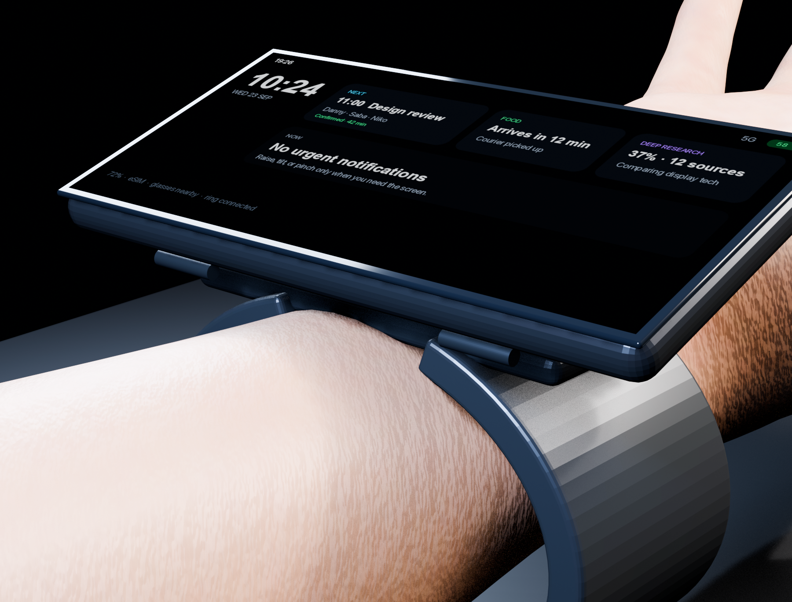
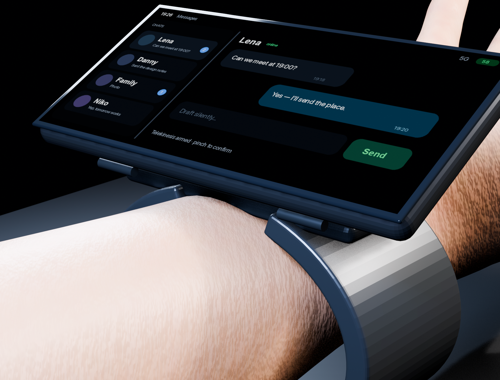
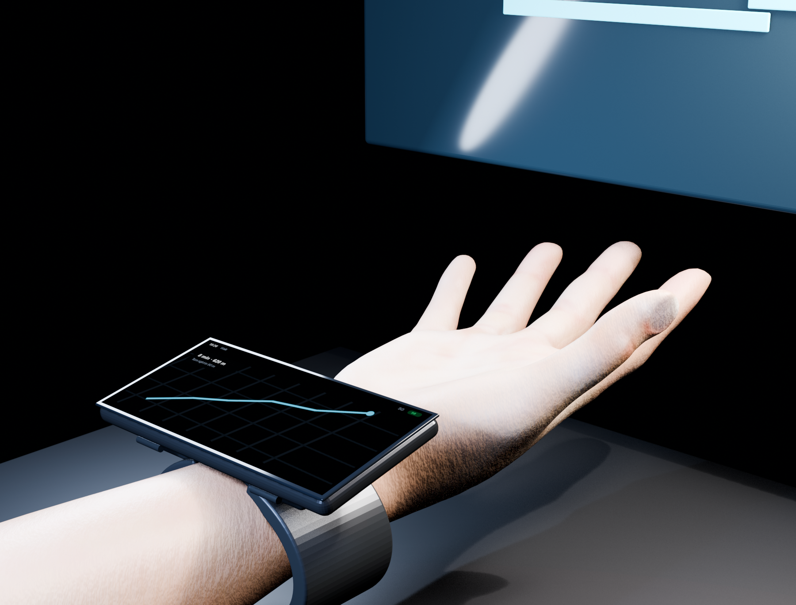

# AGENT-PHONE

**AGENT** is a wrist-worn personal computer built around a wide landscape display, [Agent OS](https://agentos-bible.vercel.app/), and keyboardless interaction. It is intentionally neither a miniature phone nor a conventional smartwatch. **AGENT-PHONE** is the public hardware repository name.

Working naming:
- **AGENT** — product / hardware family;
- **[Passport / Sapio State](https://github.com/alex-mextner/sapio-state)** — portable identity and residency research related to the device;
- **Screen** — descriptive name for the primary wrist display;
- **[Telekinesis](docs/input-research.md)** — multimodal screen-off input system;
- **[Agent Ring](docs/ring-and-spatial-input.md)** — tactile and spatial input accessory;
- **[Agent Camera](docs/camera-strategy.md)** — detachable photography module;
- **Agent Glasses** — optional gaze, spatial-context, and low-duty-cycle display accessory described across the companion-device research.

The product explores a simple premise: a personal computer should not need to occupy a hand, pocket or bag. AGENT stays on the wrist, keeps its display dark whenever possible, and hands heavy visual work to a nearby TV, monitor or optional glasses display.

## Product thesis

- One uninterrupted wide landscape OLED, visually around two Apple Watch Ultra faces side by side.
- Nearly borderless left/right edges.
- A very thin hidden tilt carrier so the wrist can rest naturally while the display faces the user.
- A detachable compute/display module with only a short-duration reserve battery.
- Most battery mass lives in the cuff/base and two curved battery plates integrated into the sides of the open cuff.
- An optional **external endurance battery** can move much more energy to the torso (underarm or lower back) through a flat clothing-integrated cable.
- Base model uses a wraparound cuff rather than a conventional buckle; Dive variant can use a secure clasp.
- No rigid battery brick under the wrist.
- eSIM only; no physical SIM.
- No games by design. Video and long-form visual work should prefer a larger nearby display.
- Optional glasses provide gaze, spatial context and a low-duty-cycle display; paired bone-conduction/private audio can read results back without lighting the wrist.
- Optional ring(s) provide tactile, spatial and eyes-free controls.
- A detachable camera tile handles deliberate photography better than pointing the whole wrist at a subject.
- Nearby displays are first-class outputs: TV/monitor, glasses and **car HUD** can receive the current navigation, media or task context instead of forcing it onto the wrist.

## Telekinesis input

**[Telekinesis](docs/input-research.md)** combines wrist sEMG, IMU, optical sensing, deliberate silent articulation, gaze, ring gestures and voice dictation.

The goal is not "mind reading." Silent speech is an intentional input mode. The system learns each user's deliberate subvocal articulation and only records it while the input mode is explicitly armed.

Screen-off composition is a core power and attention feature: the OLED can remain black while subtle haptics indicate input state, and private TTS can read the draft back for correction.

## Agent OS

AGENT is hardware for [Agent OS](https://agentos-bible.vercel.app/) ([source](https://github.com/alex-mextner/AgentOS)), an app-last, local-first, agent-native operating-system project.

Instead of shrinking phone apps onto a small display, AGENT presents task- and entity-specific views: a person, event, product, room, delivery, research task or photo can become the current interface.

See [AGENT hardware × Agent OS](docs/agent-os.md).

## Research and engineering documents

- [Product specification](SPEC.md)
- [Hardware architecture](docs/hardware-architecture.md)
- [Prototype BOM and sourcing](docs/bom.md)
- [Product and distribution strategy](docs/product-strategy.md)
- [Critical phone-failure scenarios](docs/critical-scenarios.md)
- [Deep research: keyboardless input](docs/input-research.md)
- [Ring and spatial input](docs/ring-and-spatial-input.md)
- [Camera strategy](docs/camera-strategy.md)
- [Display, silicon and connectivity](docs/display-and-connectivity.md)
- [Agent OS integration](docs/agent-os.md)
- [Visual references and design lessons](docs/references.md)
- [Naming notes](docs/naming.md)
- [Blender render pipeline](blender/README.md)

## Prototype strategy

The first physical builds deliberately separate ergonomic proof from full electronics.

1. **P0 ergonomic cuff** — PETG/TPU, real long OLED, batteries/weights in correct places, compact tilt/detach mechanism.
2. **P0 Telekinesis** — wrist sEMG/IMU + screen-off state machine, compute may remain off-body.
3. **P0 ring** — BLE/IMU/capacitive/squeeze DIY ring.
4. **P1 functional wrist** — embedded Linux/Agent OS services, camera tile, real power domains.
5. **P2 custom electronics** — wearable SoC, custom PCB/FPC, curved batteries and production-intent display.

This keeps an oversized development board from dictating the industrial design.

## Distribution hypothesis

The base AGENT device is intended to be distributed free to a limited waitlist/residency cohort. Revenue is explored through optional extensions, specialist accessories, commercial integrations and services rather than mandatory hardware margin.

This is a product hypothesis, not a finalized business model.

## Concept status

This repository is a research and industrial-design prototype. Dimensions, battery capacity, sensing accuracy, pricing and supplier availability are engineering targets or snapshots, not production claims.

## Concept renders

The [concept-render gallery](renders/) shows the device on-wrist, its tilt/detach mechanics, and representative interfaces. Current written specs remain the authority for dimensions and behavior while the physical prototype evolves.

See [the full render set](renders/README.md).
