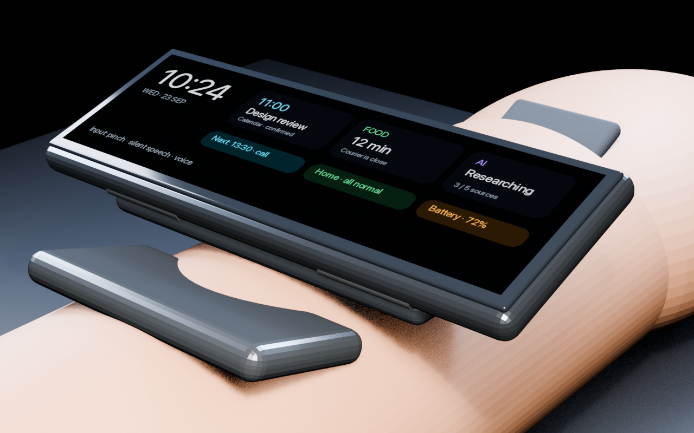
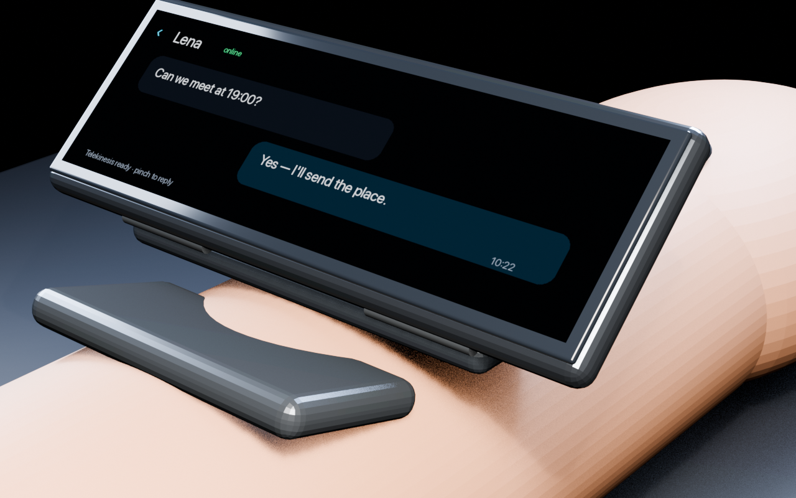
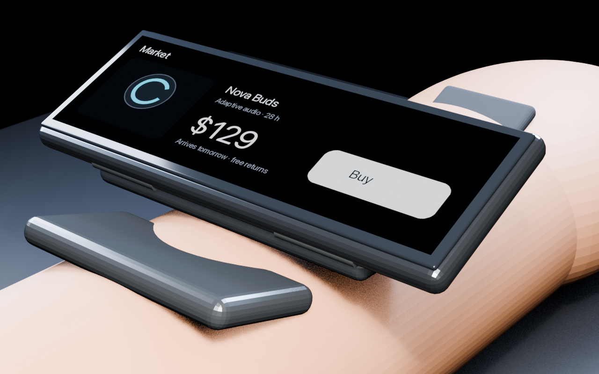
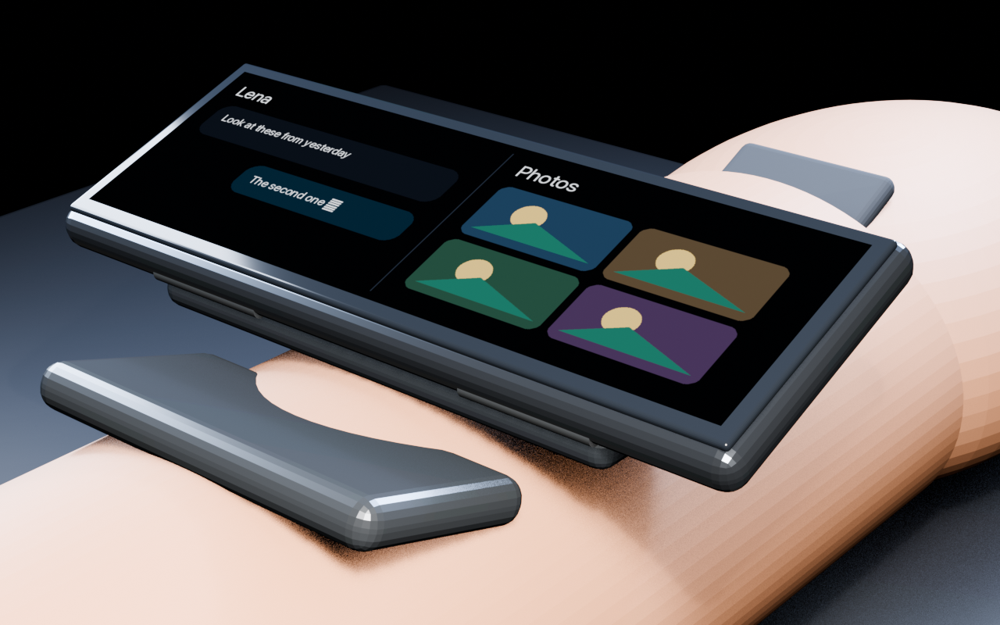
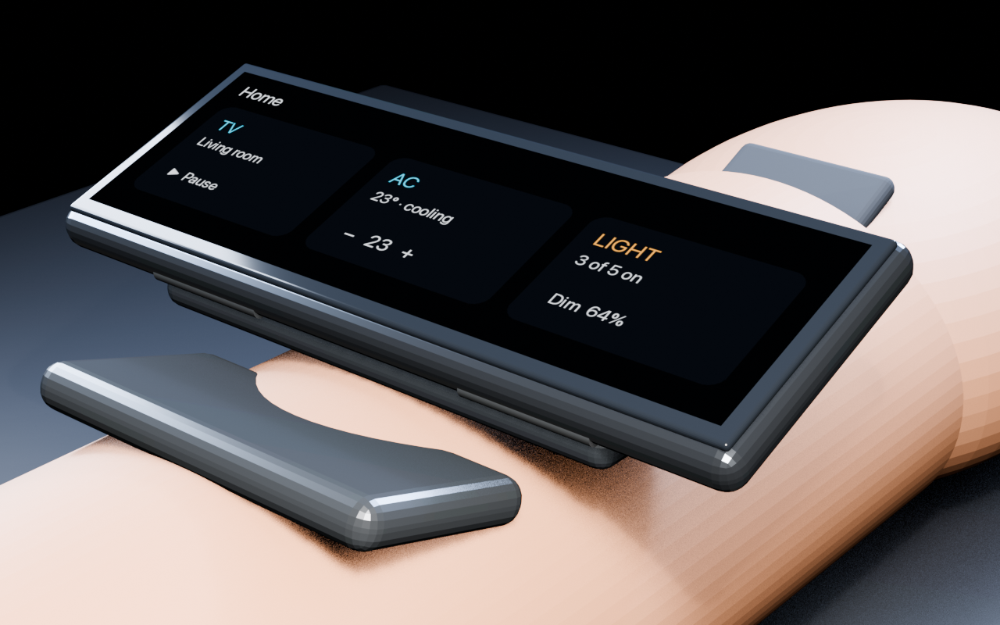
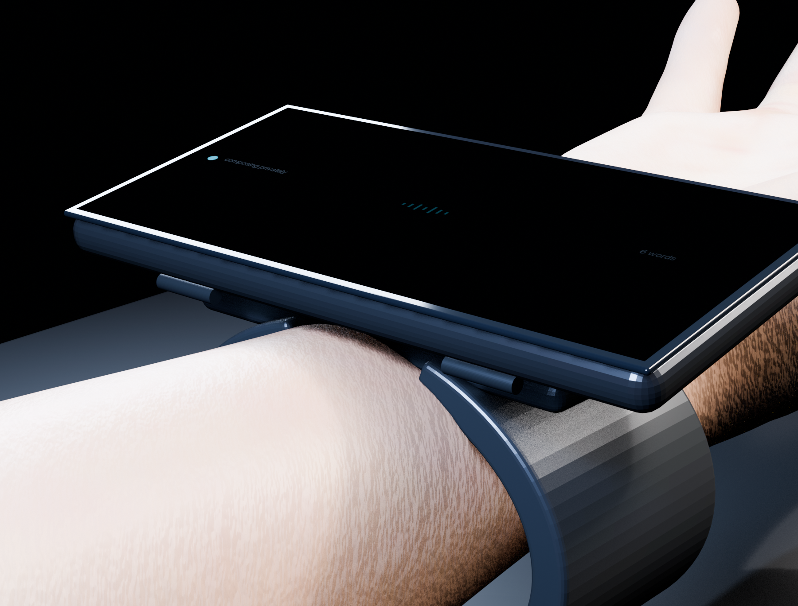
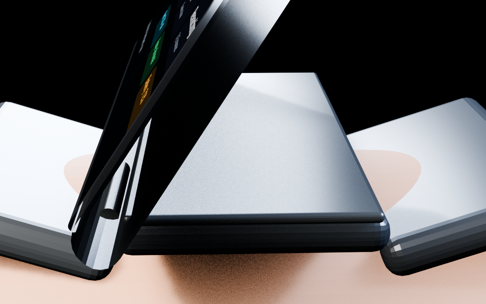
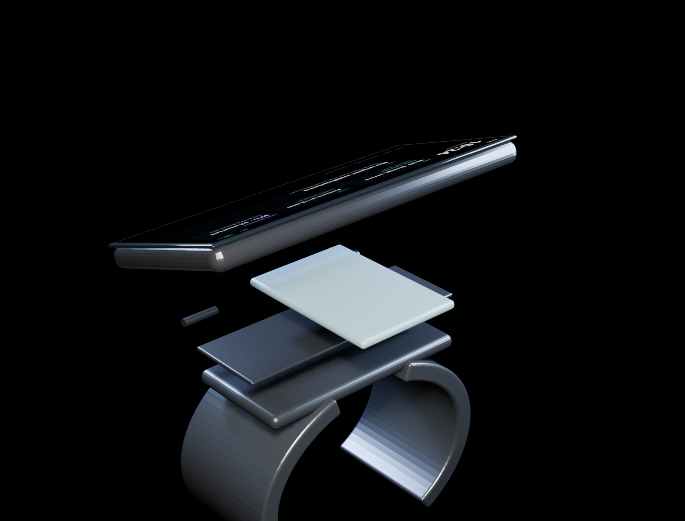

# Concept renders

These images document the current industrial-design and interaction concept. Implementation details for generating them live in [`blender/`](../blender/README.md).

| View | What it proves |
|---|---|
|  | wide borderless home surface with calendar, delivery and AI-task status |
|  | screen tilts toward the user while the wrist stays resting |
|  | purchase UI on the worn device |
|  | chat + photos split view |
|  | TV / AC / lighting control |
|  | nearly black display during private screen-off composition |
|  | thin tilted module and recessed hinge |
|  | detachable module, carrier, tiny hinge barrels and battery base |

The `screen-concept.blend` file is saved after rendering so the geometry and materials can be inspected or adjusted in Blender.
